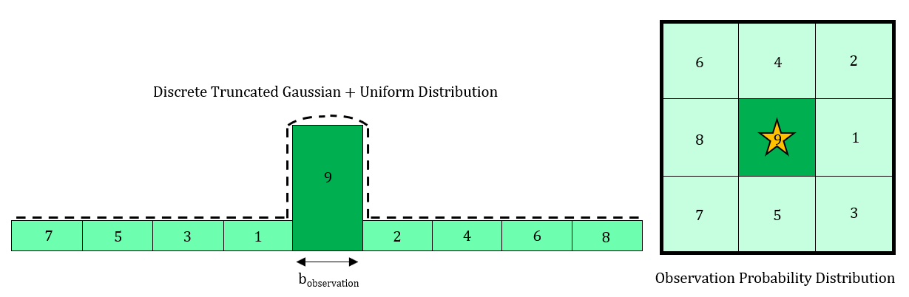

## AA228: Decision Making Under Uncertainty
Programmers: [Bradley Collicott](https://github.com/bcollico), [Daniel Neamati](https://github.com/danineamati), [Alexandros Tzikas](https://github.com/alextzik)

A full project report is available at: [AA228_FinalReport.pdf](./output/AA228_Project.pdf)
## Final Project: Multi-Agent Decentralized Connectivity Maintenance Learning
This project implements decentralized connectivity maintainence for a two-agent system, represented as a partially-observable sequential decision-making problem (POMDP) in the Julia programming language. The objective was to learn a control policy that avoids collision with obstacles and other agents while maintaining connectivity with the leader robot. The POMDP is structured on a discrete, 2D grid world with discrete state, action, and observation spaces. The policy was first trained in a cnetralized manner using the QMDP algorithm, and rolled out decentralized on each agent.

This problem takes into account uncertainty in motion (process noise) and sensing (observation noise).

### Results
The learned policy is visualized below for a stationary leader at different positions in the grid world. It is shown that that follower agent chooses to avoid collisions while maintaining a safe distance from the leader for connectivity.

     &nbsp;&nbsp;&nbsp;&nbsp;&nbsp;&nbsp; 

We show that the learned policy avoids collisions and maintains connectivity at nearly all times. A baseline comparision to a random policy shows that the POMDP representation leads to a significant performance improvement.

     

### Implementation

#### State Space
The state space is all combina tions of agent positions on a 10x10 grid world. Therefore the POMDP state space is (100)N-dimensional for N agents. The exponential growth in the size of the problem is a limiting factor for this method. The simulation space used for testing the policy is shown here:

     

#### Action Space and Transition Model
Each agent was permitted to move to any adjacent space on the grid world or remain stationary. At any time, each agent has 9 action choices, so the total action space for the POMDP is (9)N-dimensional for N agents.. To incorporation uncertainty in the motion model, a truncated Gaussian distribution is formed for the transition model. The agent selects a desired state to transition; however, the true transition is drawn from a distribution like the following:

     

#### Observation space
Similar to the action space and transition model, the observation model is also not deterministic. Observations for each agent are drawn from a truncated Gaussian distribution, with the highest probability assigned to a perfect observation, and the remaining probabily distributed among the adjacent states of the observed agents. The observation space has the same dimension as the state space.

     

